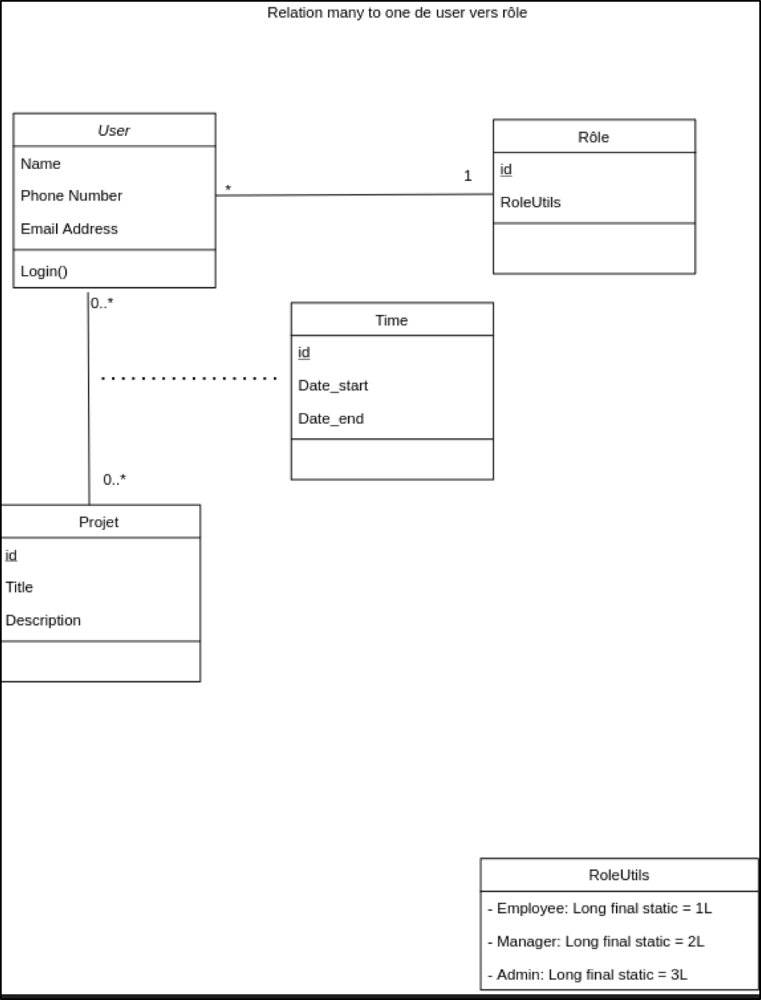

# StartupPOC 

A web application for time management  

The project is divided into back-end part and front-end part  

[StartupPOC_backend](https://github.com/TahaAlamiIdrissi/StartupPOC_backend) : the back-end of the project using 
 
 - JAVA 8
 - SpringBoot
 
[StartupPOC_frontend](https://github.com/TahaAlamiIdrissi/StartupPOC_frontend) : the front-end of the project using 
 
 - Vuejs 2
 - Vuetify 
 
# StartupPOC_backend

This project builds rest services with springboot and implements a full backend api 

# Structure
The project contains the following folders: 

- src/main/java : contains the implementation of  different classes  of the project
- src/main/test : contains unit tests for the implemented classes
- src/main/ressources : contains the __application.properties__ where we can find the configuration of  datasource and mailing properties

# Packages 

## Domain
contains the different domain classes of the project. The following class diagram presents the different attributes of our entities and the relationships between them :  

#### Repository
contains repository interface that extends JpaRepository for each domain 

#### Service
contains service interface for each domain 

#### ServiceImpl
contains classes that implement service interfaces , these classes have @Service annotation and write the business logic to store, retrieve, delete and updates data

#### Controller
contains rest controllers

#### DTO 
contains data transfer objects that encapsulate the data that we want to transfer in a single object

#### Config
contains the configuration class for spring security

#### Security
contains the class that provides the jwt token for the authenticated  user

#### Exporter 
contains the process to generate a time table in a pdf document

#### Utils
contains the _LoadDatabase.java_ that fills the database with some data for testing  and _RoleUtils.java_ that affects the role id and label to a specific values

# Api documentation

The api documentation is generated using __Swagger__ . 
This is the following link to access to the the documentation : 

# Installation 

To run the project  : 

- Import the project as a maven project 
- Run the class _HowToAchieveApplication.java _ 

 
 

